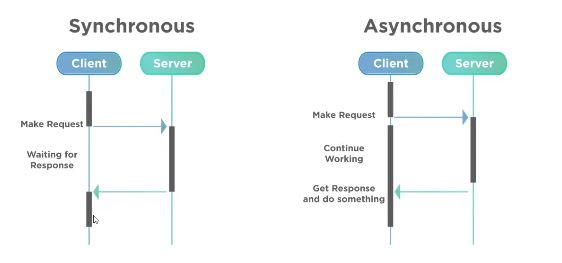

# 14. JavaScript Assíncrono

# Assincronissidade

## Definição

- Assíncrono: “O que ocorre e não se efetiva ao mesmo tempo”.
- exemplo - ensino:
    - Síncrono: os estudantes estudam em uma data/hora específica. Todos precisam estar presente naquele momento.
    - Assíncrono: os estudantes fazem os estudos e atividades em qualquer momento e em seu próprio tempo.
- O *javascript* por padrão irá rodar de maneira síncrona.



## Promises

- Objeto de processamento assíncrono.
- Inicialmente, seu valor é desconhecido.
- Ela pode, então, ser resolvida ou rejeitada.
- A *promise* tem três estados:
    1. *Pending*
    2. *Fufilled*
    3. *Rejected*

### Estrutura Promise

```jsx
const myPromise = new Promise((resolve, reject) => {
  window.setTimeout(() => {
    resolve(console.log('Resolvida!'));
  }, 2000);
});
```

- Manipulação

```jsx
const myPromise = new Promise((resolve, reject) => {
  window.setTimeout(() => {
    resolve('Resolvida!');
  }, 2000);
});

await myPromise
  .then((result) => result + ' passando pelo then')
  .then((result) => result + ' e agora acabou!')
  .catch((err) => console.log(err.message))

// Após 2 segundos retornará o valor
// 'Resolvida! passando pelo then e agora acabou!'
```

## Async/await

- funções assíncronas precisam dessas duas palavras chave.

```jsx
async function resolvePromise() {
  const myPromise = new Promise((resolve, reject) => {
    window.setTimeout(() => {
      resolve('Resolvida!')
    }, 3000);
  });

  const resolved = await myPromise
    .then((result) => result + ' passando pelo then')
    .then((result) => result + ' e agora acabou!')
    .catch((err) => console.log(err.message));
  
  return resolved;
}

await resolvePromise();
// 'Resolvida! passando pelo then e agora acabou!'
```

- usando try...catch

```jsx
async function resolvePromise() {
  const myPromise = new Promise((resolve, reject) => {
    window.setTimeout(() => {
      resolve('Resolvida!')
    }, 3000);
  });

  let result;

    try {
    result = await myPromise
      .then((result) => result + ' passando pelo then')
      .then((result) => result + ' e agora acabou!')
    } catch(err) {
      result = err.message;
    }

  return result;
}

await resolvePromise();
// 'Resolvida! passando pelo then e agora acabou!'
```

# Consumindo APIs

## O que é uma API?

- Application Programming Interface
- Uma API é uma forma de intermediar os resultados do back-end com o que é apresentado no front-end.
- Você consegue aessá-la por meio de URLs.

### JSON: JavaScript Object Notation

- é muito comum que APIs retornem seus dados no formato .json , portanto precisamos tratar esses dados quando os recebermos .

## Fetch

```jsx
fetch(url, options)
  .then(response => response.json())
  .then(json => console.log(json))

// retorna uma Promise
```

- Operações no banco (POST, GET, PUT, DELETE, etc.)

```jsx
fetch('https://endereco-api.com/', {
  method: 'GET',
  cache: 'no-cache'
})
  .then(response => response.json())
  .then(json => console.log(json))

  // retorna uma Promise
```

```jsx
fetch('https://endereco-api.com/', {
  method: 'POST',
  cache: 'no-cache',
  body: JSON.stringify(data)
})
  .then(response => response.json())
  .then(json => console.log(json))

  // retorna uma Promise
```