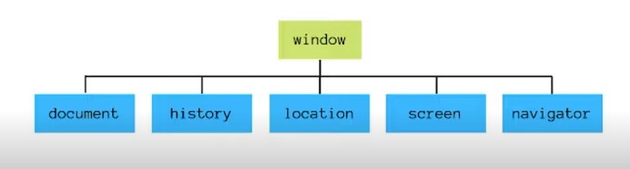

# 17. Manipulando a D.O.M. com JavaScript

# Entendendo o D.O.M.

## O que é

- *Document Object Model*
- O DOM HTML é um padrão de como acessar e modificar elementos HTML de uma página.

## DOM vs BOM

- **BOM**: *Browser Object Model*



- Tudo o que está dentro do objeto *window*

# Selecionando Elementos

## Estrutura HTML

- tag
    - id
    - classe

## Métodos

Selecionando os elementos de uma página

```jsx
document.getElementsByTagName('li')
/*
	[
		<li>Item 1</li>
		<li>Item 2</li>
		<li>Item 3</li>
	]
```

```jsx
document.getElementsById('titulo')
// <h1 id="titulo">Título</h1>
```

```jsx
document.getElementsByClassName('textos')
/*
	<section class="texto">
		<h1>Titulo texto 2</h1>
		<p>exemplo texto 1</p>
	</section>

	<section class="texto">
		<h1>Titulo texto 2</h1>
		<p>exemplo texto 2</p>
	</section>
```

```jsx
document.querySelectorAll('.primeira-classe .segunda-classe')
/* [
  <div class="primeira-classe segunda-classe">
  <ul>
    <li class="opcao">Opção 1</li>
    <li class="opcao">Opção 2</li>
    <li class="opcao">Opção 3</li>
    <li class="opcao">Opção 4</li>
  </ul>
</div>
] */
```

```jsx
document.querySelectorAll('li .opcao')
/* [
  <li class="opcao">Opção 1</li>
  <li class="opcao">Opção 2</li>
  <li class="opcao">Opção 3</li>
  <li class="opcao">Opção 4</li>
]*/
```

### Adicionar e deletar

| Método | Descrição |
| --- | --- |
| document.createElement(element) | Cria um novo elemento HTML |
| document.removeChild(element) | Remove um elemento |
| document.appendChild(element) | Adiciona um elemento |
| document.replaceChild(new,old) | Substitui um elemento |

# Trabalhando com estilos

## Classes

`Element.classList`

```jsx
const meuElemento = document.getElementById('meu-id');
  meuElemento.classList.add("novo-estilo");
  // Adiciona a classe "novo-estilo"
  meuElemento.classList.remove("classe");
  // Remove a classe "classe"
  meuElemento.classList.toggle("dark-mode");
  // Adiciona a classe "dark-mode" caso ela não faça parte da
  // lista e remove ela caso faça
```

## CSS

Acessando diretamente o CSS de um elemento

```jsx
document.getElementsByTagName("p").style.color = "blue"
```

# Eventos

## Tipos

- Eventos do mouse: mouseover, mouseout
- Eventos de clique: click, dbclick
- Eventos de atualização: change, load

## Adicionando

### Event Listener

- Diretamente no JavaScript, cria um evento que vai ser acionado no momento em que o usuário realizar determinada ação.

```jsx
const botao = document.getElementById("meuBotao");

botao.addEventListener("click", outraFuncao);
```

## Atributo HTML

- Especifica a função  a ser chamada  diretamente no elemento HTML.

```jsx
<html>
  <body>
    <h1 onclick="mudaTexto(this)">Clique aqui!</h1>
  </body>
  <script>
    function mudaTexto(id) {
      id.innerHTML = "Mudei!";
    }
  </script>
</html>
```

## **Atividade: Light Mode/Dark Mode**

1. Crie uma estrutura básica de projeto front-end (HTML, CSS e JS)
2. Copie o HTML e o CSS deste repositório
3. Crie um arquivo chamado `scripts.js` na sua pasta `assets/js`
4. Selecione os elementos: `h1`, `button`, `footer` e `body`
5. Se os elementos possuirem a classe `dark-mode`, modifique seus estilos. Caso contrário, volte os estilos para o original